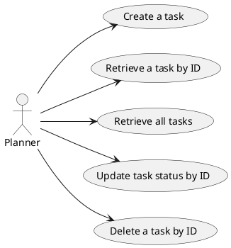

# TODO Backend Using DynamoDB

## Use cases covered by controllers


## Decisions and Questions


## Controller test snippets

**Test create**
```bash
curl --header "Content-Type: application/json" \
  --request POST \
  --data '{"title":"title", "description":"Book call with client", "assignee": "me", "due": "2026-06-19T17:00"}' \
http://localhost:8080/todo/create
```
**Test Retrieve by ID - last param is ID**
```bash
curl -X GET "http://localhost:8080/todo/get/9e773edd-cc5c-4930-a8d5-e925ffb8fae9"```

**Test Retrieve all**
```bash
curl -X GET "http://localhost:4000/task-manager/get-all-tasks" | jq
```
**Test Update by ID**

```bash
curl --header "Content-Type: application/json" \
  --request PUT \
  --data '{"id":"9e773edd-cc5c-4930-a8d5-e925ffb8fae9", "title":"UPDATED", "description":"Book call with client", "assignee": "me", "due": "2026-06-19T17:00", "createdAt": "2026-06-19T17:45:22.955242"}' \
http://localhost:8080/todo/update
```
**Test Delete by ID**

```bash
curl -X DELETE "http://localhost:8080/todo/delete/9e773edd-cc5c-4930-a8d5-e925ffb8fae9"
```