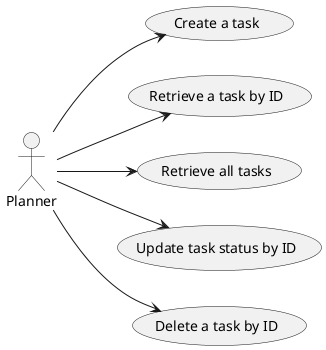

# TODO Backend Using DynamoDB

## Use cases covered by controllers


## Decisions and Questions


## Controller test snippets

**Test create**
```bash
curl --header "Content-Type: application/json" \
  --request POST \
  --data '{"caseNumber":"CASE-0001", "title":"title", "description":"Book call with client", "status": "New"}' \
http://localhost:4000/task-manager/create-task
```
**Test Retrieve by ID - last param is ID**
```bash
curl -X GET "http://localhost:4000/task-manager/get-task/1"
```

**Test Retrieve all**
```bash
curl -X GET "http://localhost:4000/task-manager/get-all-tasks" | jq
```
**Test Update by ID**

```bash
curl --header "Content-Type: application/json" \
  --request PUT \
  --data '{"id":1, "caseNumber":"CASE-0001", "title":"UPDATED", "description":"Book call with client", "status": "In Progress", "createdDate":"2025-08-02T18:17:15.174236"}' \
http://localhost:4000/task-manager/update-task
```
**Test Delete by ID**

```bash
curl -X DELETE "http://localhost:4000/task-manager/delete-task/1"
```